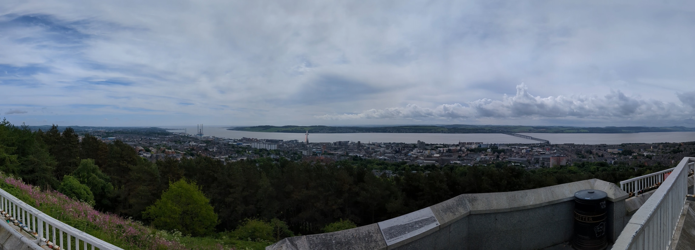

## The meeting
- ~45 people
- 3 days
    - Day 1: community talks
    - Day 2: OMERO training talks, workshops
    - Day 3: Unmeeting

## An aside: unmeetings/unconferences
- participant-driven: no agenda
- bottom-up organization
- agenda is collectively agreed upon at the beginning
- any discussions can claim a time and space
- more useful amongst experts

## Day 0: speakers' dinner
- Private dinner for invited speakers
- chance to meet informally and network
- we had some nice tapas

## Day 1 takeaways
- Large national entities (German Bioimaging, France Bioimaging, NL-Bioimaging) are heavily invested in this ecosystem
- mix between centralized and distributed infrastructure 
- large public data repositories also rely heavily on OME
- metadata standards still unclear
- Multiple efforts on OME-Zarr processing, Slurm connections

## Day 2 takeaways
- OMERO being used in many training/workshop settings
- Half-successful attempt at deploying OMERO for managing data during a hands-on microscopy workshop
- Collaboration with Indonesia (with started with "abuse" of a demo server)
- A LOT of Zarr talk: v3 specs, sharding, conversions, future of the format
- OME-NGFF challenge (more on that in a bit)

## Day 3 takeaways
- Organizing the NGFF challenge
    - logistics
    - metadata specs
    - tooling
- next year's OME meeting (maybe here?)

## a few photos

## a few photos
