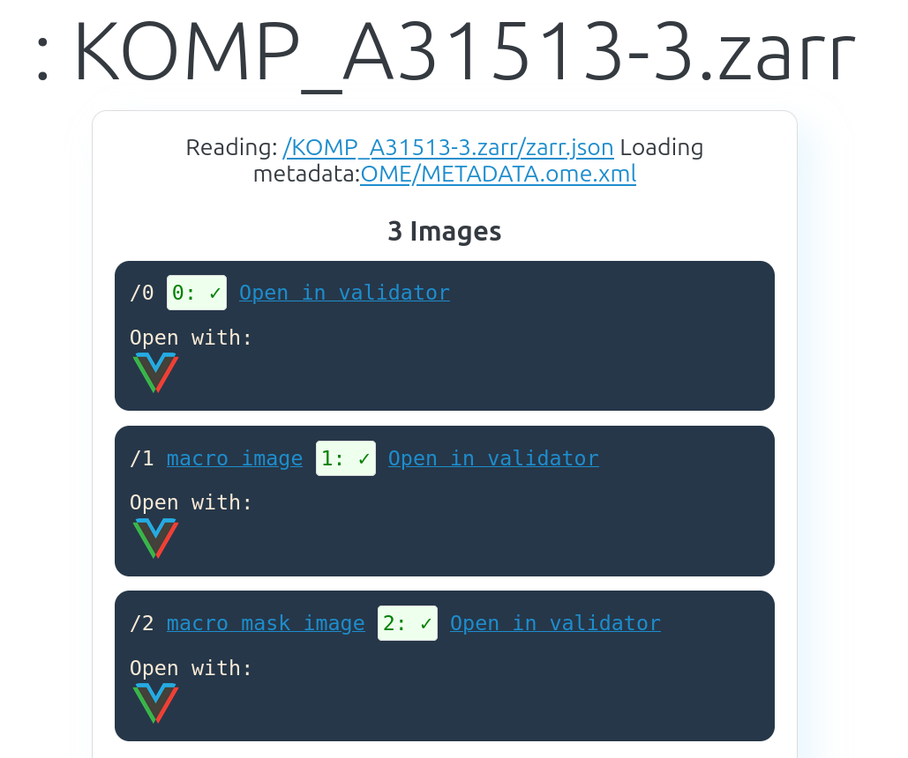

# Personal intro

## Hello!

:::: {.columns}

::: {.column width="65%"}
- I am **very** excited to be here!
- Quick background:
    - Engineering undergrad 
    - Computational physics M.Sc. and Ph.D.
    - Working with microscopy data for the last (almost) 8 years
- Outside work: video games (especially speedrunning), hiking, swimming
:::

::: {.column width="35%"}
```{=html}
<video style="display: block; margin: 0 auto;" controls muted autoplay loop>
  <source src="datamanagementAI_images/myVisitedPlaces.webm" type="video/webm">
</video>
```
:::

::::

::: {.notes}
Speaker notes go here.
:::

# Let's talk about AI (the fun part)

## AI is data-hungry.{.center}


## 

{width=80% fig-align="center"}

::: aside
Kirillov A, Mintun E, Ravi N, Mao H, Rolland C, Gustafson L, Xiao T, Whitehead S, Berg AC, Lo WY, Dollár P. Segment anything. In Proceedings of the IEEE/CVF international conference on computer vision 2023 (pp. 4015-4026).
:::

## Provisioning, storing, maintaining large amounts of data is _not trivial_. {.center}

##

{width=80% fig-align="center"}

::: aside
from [Century-Scale Storage by Maxwell Neely-Cohen](https://lil.law.harvard.edu/century-scale-storage/)

from [AWS S3 Pricing](https://aws.amazon.com/s3/pricing/)
:::

{width=80% fig-align="center"}

## _Any_ data won't be enough. {.center}

##

{width=49% fig-align="center"}
{width=49% fig-align="center"}

::: aside
from the [Cell Image Library](https://www.cellimagelibrary.org/images/CCDB_6843)
:::

##

{width=60% fig-align="center"}

::: aside
Sarkans U, Chiu W, Collinson L, Darrow MC, Ellenberg J, Grunwald D, Hériché JK, Iudin A, Martins GG, Meehan T, Narayan K. et al. REMBI: Recommended Metadata for Biological Images—enabling reuse of microscopy data in biology. Nature methods. 2021 Dec;18(12):1418-22.
:::

## Case study: the NGFF Challenge {.center}

##

{width=80% fig-align="center"}

::: aside
[NGFF Challenge unified front-end](https://ome.github.io/ome2024-ngff-challenge/) displaying federated datasets managed by multiple institutions. Standardized metadata allows all data to be queried regardless of where it is stored.
:::

##

{width=49% fig-align="center"}
{width=49% fig-align="center"}

::: aside
[NGFF Validator](https://ome.github.io/ome-ngff-validator/) and [vizarr](https://hms-dbmi.github.io/vizarr/) views of the [same data](https://storage.googleapis.com/jax-public-ngff-2024/public_data/1545/whitej_205/2020-08/18/15-45-07.426/KOMP_A31513-3.zarr)
:::


# Let's talk about AI (the ugly part)

## Licensing is still murky and complex. {.center}

##

{width=49% fig-align="center"}
{width=49% fig-align="center"}
{width=49% fig-align="center"}
{width=49% fig-align="center"}

::: aside
From [Reuters](https://www.reuters.com/legal/thomson-reuters-wins-ai-copyright-fair-use-ruling-against-one-time-competitor-2025-02-11/), [The New York Times](https://www.nytimes.com/2023/12/27/business/media/new-york-times-open-ai-microsoft-lawsuit.html), [Getty Images (US), Inc. v. Stability AI, Inc.](https://www.courtlistener.com/docket/66788385/getty-images-us-inc-v-stability-ai-inc/), [Concord Music Group, Inc. v. Anthropic PBC](https://www.courtlistener.com/docket/68889092/concord-music-group-inc-v-anthropic-pbc/)
:::

## Anything public-facing will have to deal with resources being abused. {.center}

##

{width=45% fig-align="center"}
{width=45% fig-align="center"}
{width=45% fig-align="center"}
{width=45% fig-align="center"}

::: aside
From [Ars Technica](https://arstechnica.com/ai/2025/03/devs-say-ai-crawlers-dominate-traffic-forcing-blocks-on-entire-countries/), [Thales](https://cpl.thalesgroup.com/about-us/newsroom/2025-imperva-bad-bot-report-ai-internet-traffic), [TechCrunch](https://techcrunch.com/2025/01/10/how-openais-bot-crushed-this-seven-person-companys-web-site-like-a-ddos-attack/), [OpenTools](https://opentools.ai/news/open-source-devs-take-on-rogue-ai-crawlers-with-ingenuity-and-vengeance)
:::

# Takeaways: where do we go from here?

## The ugly part has no clear solution and will be an evolving picture for the near future.{.center}

## The fun part is solved on the technical side; the challenge is societal and lowercase-p political. {.center}

# Thanks! {.center}
