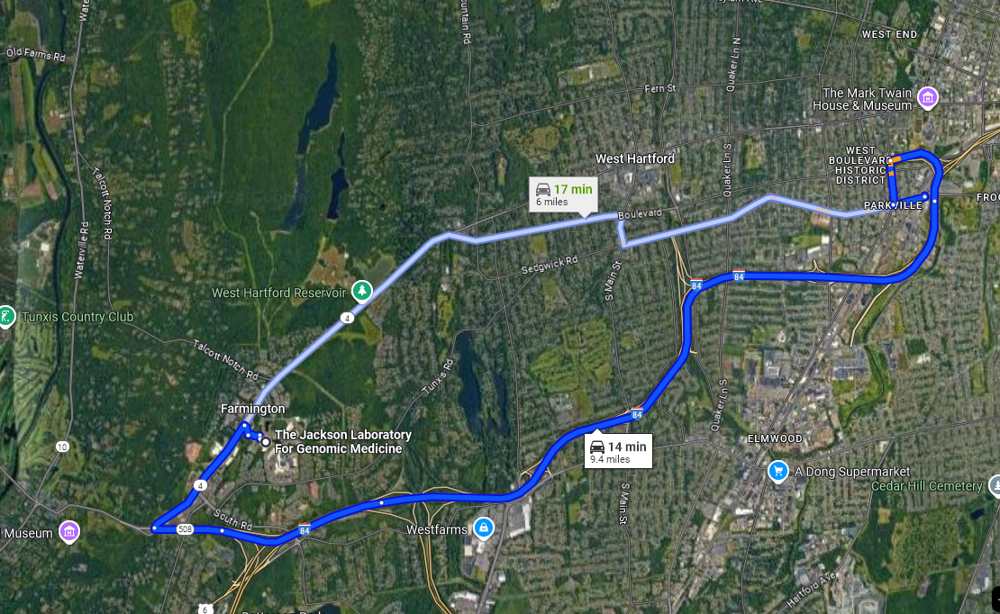

# Welcome, everyone!

# Logistics
## Fire alarms
- There are no fire alarm tests scheduled
- If you hear an alarm, chances are it's real!

## Exits
{height="550" fig-align="center"}

## Assembly point
{height="550" fig-align="center"}

# Program
## Sessions today
### Session 1 (10-11 AM):
::: {.nonincremental}
- **Matt Mahoney (JAX)**: Pictures as phenotypes: computer vision in quantitative genetics
- **Mariana de Niz (Northwestern)**: Analyzing dynamic host-pathogen interactions in intravital microscopy images
:::
11-11:30AM: coffee break

## Sessions today
### Session 2 (11:30-12:30 PM): 
::: {.nonincremental}
- **Alex Cunha (Caltech)**: Segmenting cells in 2D and 3D with jcell
- **Christina Baer (UMass Med School)**: Image Analysis Challenges in the Age of Spatial 'Omics
:::
12:30-2 PM: lunch

## Sessions today
### Session 3 (2-3:30 PM): 
::: {.nonincremental}
- **Carsen Stringer (HHMI Janelia)**:  Cellpose3: one-click image restoration for improved cellular segmentation
- **Fernando Cervantes (JAX)**: Transfer learning in Napari with the Active Learning plugin
- **Brian Northan (True North)**: Jupyter Notebooks and Napari Widgets for evaluating and comparing Deep Learning Frameworks 
:::
3:30-4:30 PM: Social hour and networking

## Social hour
- We'll have **non-alcoholic** beverages and snacks right outside
- This is the perfect time to go talk to someone whose talk you found interesting!
- At 4:30 PM or so we will move to...

## Dinner
::: {.nonincremental}
- This is not part of the program, so feel free to go rogue and eat elsewhere!
- We recommend **Parkville Market** (Parkville Market, 1400 Park St, Hartford, CT)
:::

{height="350" fig-align="center"}

## Dinner
{height="350" fig-align="center"}

::: {.nonincremental}
- 19 different restaurants from all kinds of cuisines
- something for everyone
- communal tables!
:::

# Tomorrow
## Sessions
### Session 4 (9-10 AM): 
::: {.nonincremental}
- **Juan Nunez-Iglesias (Monash)**: Explore, annotate, and analyse image data
- **Alexandr Kalinin (Broad)**: Foreground-aware virtual staining for 3D nuclear morphometry
:::
10-10:30 AM: Coffee Break

## Sessions
### Session 5 (10:30-12 PM): 
::: {.nonincremental}
- **Jennifer Waters (HMS)**: Talking to biologists and microscopists about image analysis
- **Caroline Malin-Mayor (HHMI Janelia)**: The Motile Tracker: Towards a New Paradigm for Cell Tracking
- **Kiya Govek (JAX)**: FAIR image data hosting in OMERO with containerized deployment and next-generation file formats
:::
12-1:30 PM: Lunch

## Sessions
### Panel Discussion (1:30-2:30 PM): Bioimage analysis in the era of AI: opportunities, challenges, pitfalls
::: {.nonincremental}
- **Moderator: Peter Sobolewski (JAX)**
- **Name 1**
- **Name 2**
- **Name 3**
:::
2:30-3 PM: Coffee Break

## Sessions
### Session 6 (3-4 PM): 
::: {.nonincremental}
- **Seamus Mawe (JAX)**: An efficient, push-button workflow for vision transformer transfer learning on whole-slide images
- **Ranit Karmakar (HMS)**: Advanced Image Analysis for Kidney Tissue Characterization Using Normalized Raman Imaging (NoRI) and Segment Anything
- **Maria Theiss (HMS)**: Two ways of quantifying inflammation in histopathology slices of the mouse pancreas
:::
4 PM: Wrap-up

# Acknowledgments

## Organizing committee
- Beth Cimini (Broad)
- Dave Mellert (JAX)
- Erick Ratamero (JAX)
- Simon Noerrelykke (HMS)

## JAX Education
- Stefanie Roth (go thank Stef!)
- Brent Berwin

## Bioimaging North America
- Nikki Bialy
- Vanessa Orr

