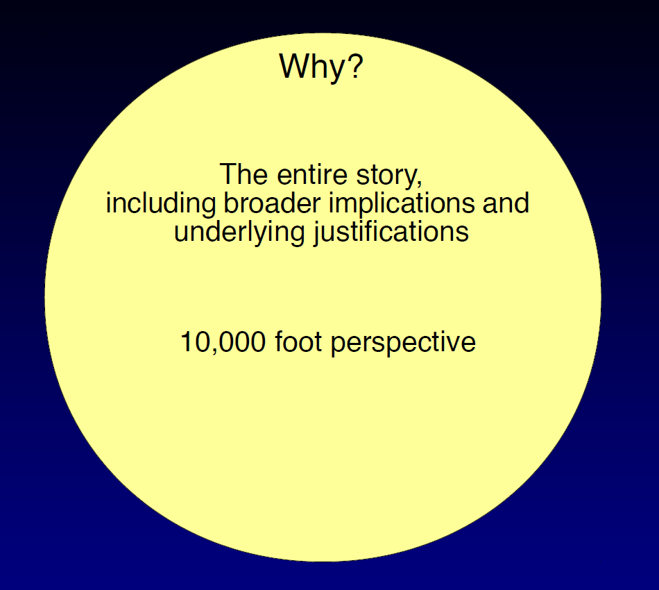
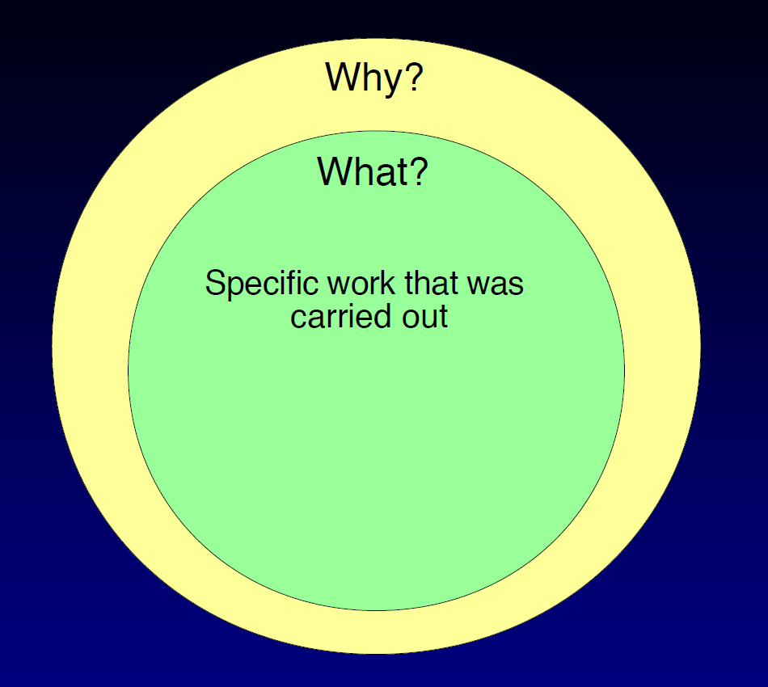
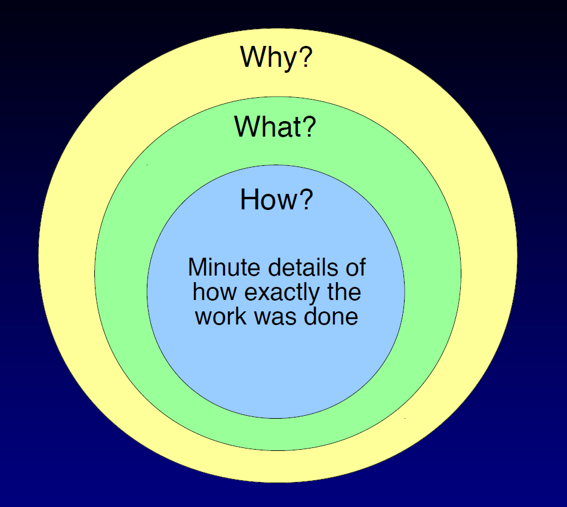
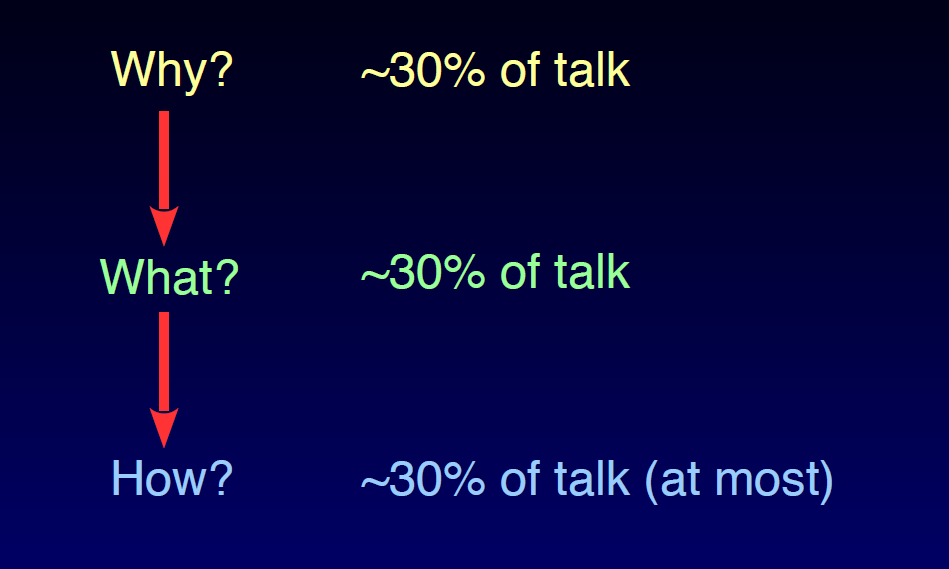

## Presentations are your best chance to show people what you're actually good at.{.center}

## Quick summary of what we'll cover

- Presenting an engaging story
- Designing slides
- What _not_ to do

::: {.notes}
Speaker notes go here.
:::

# Presenting an engaging story

## The onion model

{fig-align="center"}

## The onion model{transition="none"}

{fig-align="center"}

## The onion model{transition="none"}

{fig-align="center"}

## The onion model{transition="none"}

{fig-align="center"}

Always go from the outside in!

## Use equal times for each layer!

{fig-align="center"}

# Designing slides

## The title of the slide makes an [assertion]{style="color:red"}

:::{#title-slide .center}
The slide body provides the [evidence]{style="color:red"} to support the assertion
:::

## Examples{.center}

## Example 1

Here's example 1

## Example 2

Here's example 2

## Remember to make clear assertions your audience can follow easily!{.center}