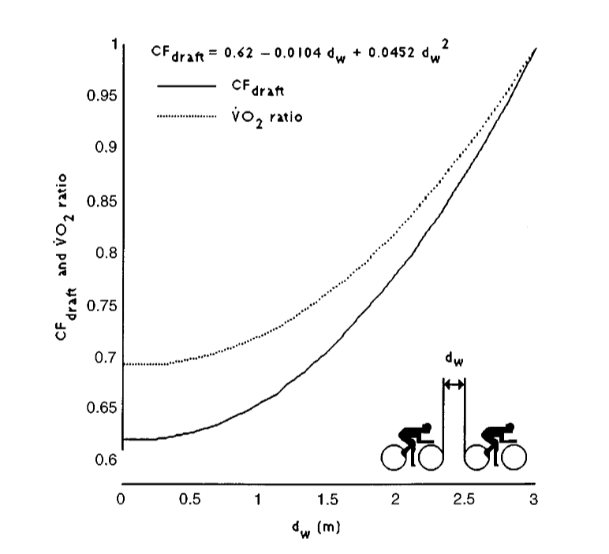

## This is a scientific literate audience. I can start with an equation, right?

$$
P = P_{air} + P_{roll} + P_{grade}
$$

## Just kidding. Two equations.

$$
P = P_{air} + P_{roll} + P_{grade}
$$
$$
CF_{draft} = 0.62 - 0.0104 d_w + 0.0452 d^{2}_{w}
$$

## OK. Maybe a few more.

$$
P = P_{air} + P_{roll} + P_{grade}
$$
$$
CF_{draft} = 0.62 - 0.0104 d_w + 0.0452 d^{2}_{w}
$$
$$
P_{air} = k CF_{draft} v^3
$$
$$
P_{roll} = C_r g(M+M_b) v
$$
$$
P_{grade} = G_r g(M+M_b) v
$$
$$
P = (C_r + G_r) g (M+M_b)v + kCF_{draft}v^3
$$

# Convinced yet?

## I swear the equations are relevant. But let's start elsewhere: the fundamental principle of road cycling

:::{#title-slide .center}
If you can avoid leading, do so.
:::

## AHA EQUATION JUMPSCARE

$$
CF_{draft} = 0.62 - 0.0104 d_w + 0.0452 d^{2}_{w}
$$
$$
P = (C_r + G_r) g (M+M_b)v + kCF_{draft}v^3
$$

where $d_w$ is the distance from your front wheel to someone else's back wheel.

## Enjoy this picture from a 1997 paper

{fig-align="center"}

40% energy savings! You'd be silly _not_ to be behind someone else. Sitting in front if a _burden_, and that's essential.

# Let's consider some examples.

## 1x1 race: what's the optimal strategy?

- Sitting behind the other person the whole race until the very end, when you overtake them because your legs are fresher.
- They obviously want to do the same.
- You both have an incentive to go slow to force the other person to be ahead.

## Ergo...

{fig-align="center"}

## A regular cycling race has 100-200 people. What happens then?

- Incentives are still the same: no one has a reason to go fast. Unless...

## If you think you have no chance of winning anyway, why not?

{fig-align="center"}

## A typical cycling race, in summary:

- A small group breaks away
- The peloton (main group) "manages" the gap to the small group (more legs to share the burden!)
- Peloton catches the small group close to the end
- Final sprint

# Everything I just said? Throw it out the window on uphills.

## Why?
$$
P = (C_r + G_r) g (M+M_b)v + kCF_{draft}v^3
$$

$G_r$ increases, $v$ decreases sharply. Benefit of being behind someone else decreases sharply.

## It's every person for themselves.

{fig-align="center"}

# So, let's recap.

- Being ahead: bad (except at the very end)
- If no one wants to be ahead, strategy is _weird_
- Being ahead is _way less bad_ if you're climbing

# Go watch some cycling! It's good.